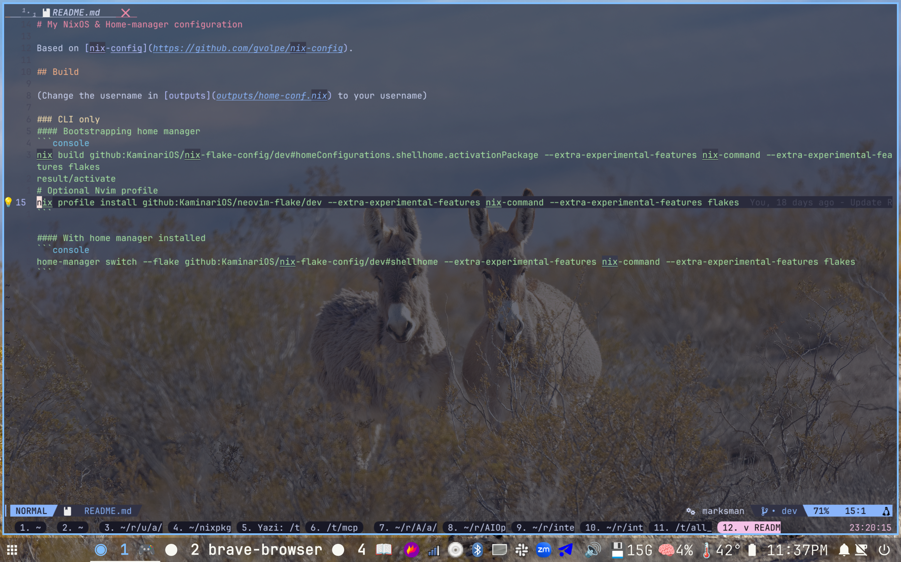

# Kosumi's NixOS & Home Manager Configuration

A comprehensive, flake-based NixOS and Home Manager configuration optimized for a keyboard-centric workflow. This setup provides a fully reproducible development environment across multiple machines, featuring extensive GUI and CLI tools, custom themes, and modular configurations.

## Preview



*Desktop preview showcasing the sway window manager, waybar, and custom theming.*

## Features

This configuration includes a wide range of modules and tools tailored for productivity and customization:

### Programs
- **Terminals**: WezTerm
- **Editors**: Neovim (with custom Lua config)
- **Browsers**: Brave(default), Google Chrome, Firefox
- **Development Tools**: Git, GitUI, Fish shell, Starship prompt
- **Utilities**: Yazi(file manager), Okular(PDF viewer)

### Services
- **Window Managers**: Sway (Wayland)
- **Bars and Widgets**: Waybar
- **Notifications**: Dunst, Mako
- **Systemd**: Random wallpaper
- **Network**: NetworkManager, Tailscale, SSH

### Shell Environment
- **Shells**: Fish (with Bobthefish theme)
- **Tools**: Bat (cat replacement), FZF, Ripgrep, Yazi(file explorer), Zellij

### Themes and Appearance
- **Stylix Integration**: Unified theming for GTK, Qt, and terminal applications
- **Fonts**: Custom font packages including Noto, JetBrains Mono, Font Awesome, and more
- **Icons and Cursors**: WhiteSur theme, custom cursors
- **Wallpapers**: Automated wallpaper rotation

### Security and Hardware
- Virtualization with Docker and Podman
- PostgreSQL database setup

## Project Structure

```
.
├── flake.nix                 # Main flake definition with inputs and outputs
├── flake.lock                # Flake lock file
├── home/                     # Home Manager configurations
│   ├── home.nix              # Main home config with packages and services
│   ├── programs/             # Program-specific configs (alacritty, firefox, etc.)
│   ├── services/             # User services (eww, sway, waybar, etc.)
│   ├── shellEnv/             # Shell environment configs (fish, nvim, git, etc.)
│   ├── themes/               # Theme definitions
│   ├── overlays/             # Custom overlays
│   ├── scripts/              # Custom scripts
│   └── age/                  # Age encryption configs
├── system/                   # NixOS system configurations
│   ├── configuration.nix     # Common NixOS config
│   ├── machine/              # Machine-specific configs
│   │   ├── savior/
│   │   ├── portable/
│   │   ├── redmoon/
│   │   └── thinker/
│   ├── fonts/                # Font packages
│   └── cachix.nix            # Binary cache config
├── outputs/                  # Flake outputs
│   ├── home-conf.nix         # Home Manager configurations
│   └── nixos-conf.nix        # NixOS configurations
├── assets/                   # Images and assets
├── wallpaper/                # Wallpaper scripts and images
└── LICENSE                  # License file
```

## Installation and Setup

### Prerequisites
- Nix package manager with flakes enabled (`experimental-features = ["nix-command" "flakes"]`)
- For NixOS: Root access for system rebuilds
- For non-NixOS: Basic Nix setup

### Bootstrapping Home Manager (CLI Only)
For a minimal CLI environment that works on non-NixOS systems:

```bash
# Build the shellhome profile
nix build github:KaminariOS/nix-flake-config/dev#homeConfigurations.shellhome.activationPackage --extra-experimental-features nix-command --extra-experimental-features flakes

# Activate the profile
./result/activate

# Optional: Install Neovim profile
nix profile install github:KaminariOS/neovim-flake/dev --extra-experimental-features nix-command --extra-experimental-features flakes
```

### Switching Home Manager Configurations
With Home Manager installed:

```bash
# CLI only profile
home-manager switch --flake github:KaminariOS/nix-flake-config/dev#shellhome --extra-experimental-features nix-command --extra-experimental-features flakes

# Full GUI profile (replace 'kosumi' with your username)
home-manager switch --flake '/path/to/this/repo#kosumi'
```

### NixOS System Configuration
For full system management:

```bash
# Replace 'thinker' with your hostname (savior, portable, redmoon, thinker)
sudo nixos-rebuild switch --flake .#thinker
```

## Usage

### Home Configurations
- **`kosumi`**: Full GUI configuration with all programs, services, and themes
- **`shellhome`**: Minimal CLI-only setup for servers or non-GUI environments
- **`shellhomeForWork`**: Work-specific CLI configuration
- **`cloud`**: Cloud-optimized minimal setup

### NixOS Hosts
- **`savior`**: Main desktop configuration
- **`portable`**: Laptop configuration
- **`redmoon`**: Secondary desktop
- **`thinker`**: Workstation setup

### Customization
- Modify `home/home.nix` for global home-manager changes
- Update `system/configuration.nix` for system-wide NixOS settings
- Machine-specific configs in `system/machine/<hostname>/`
- Add new programs/services in respective directories
- Use `home/themes/` and Stylix for theming adjustments

### Development Shell
A development shell with formatting and linting tools is available:

```bash
nix develop
```

This includes Alejandra (formatter), Deadnix, Statix, Typos, and more.

## Screenshots

### Desktop Environment
The configuration uses Sway as the window manager with Waybar for the status barand custom theming via Stylix. The setup is optimized for keyboard navigation with minimal mouse usage.

## License

This project is licensed under the terms specified in the [LICENSE](LICENSE) file.

## Acknowledgments

- Based on [gvolpe/nix-config](https://github.com/gvolpe/nix-config)
- Uses various Nix community projects and overlays
- Inspired by the NixOS and Home Manager communities
